# Enterprise Active Directory Home Lab

This project simulates an enterprise Active Directory environment using DNS, DHCP, and SIEM tools

Tools:
-Oracle Virtualbox
-Windows Server 2025
-Windows 11 Pro
-Splunk SIEM 

## Step 1: Configured Windows server 

Set up the server to have a static IP and subnet of 192.168.1.10/24 and DNS pointing to that IP 

### Windows Server Configuration
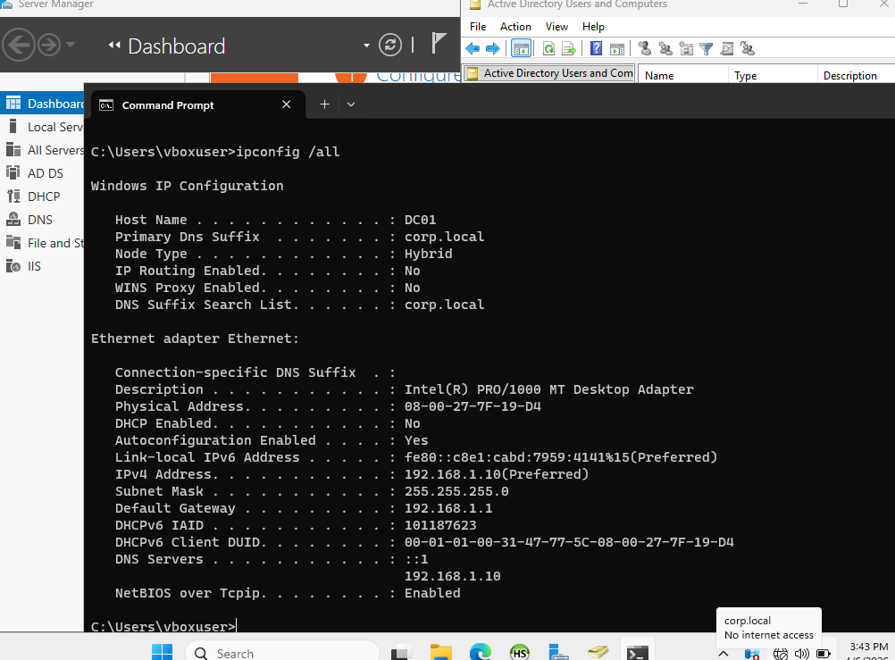

## Step 2: Promoted Windows Server to Domain Controller 

I installed Active Directory Domain Services and setup the domain controller for domain corp.local

### Active Directory Domain Services Setup
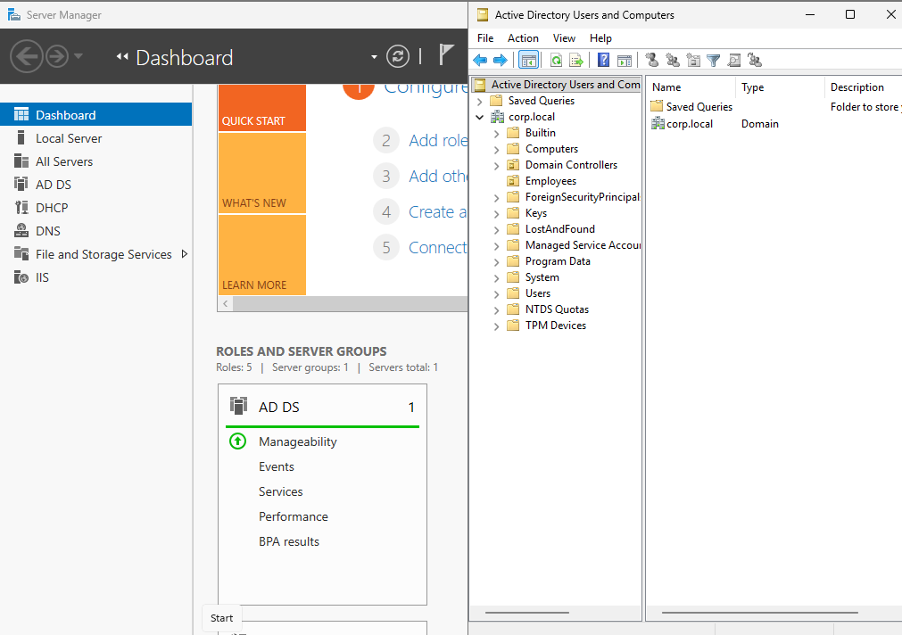

## Step 3: Installed DNS in Server Manager

Installed DNS in Server Manager so client machines can join the domain 

### DNS Setup in Server Manager
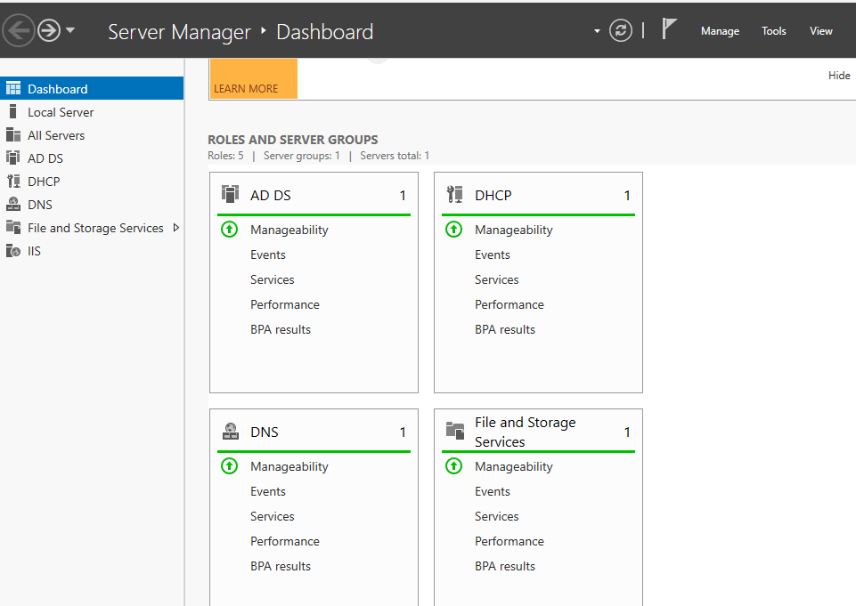

## Step 4: Created Users and Groups

I created various users and groups to simulate a real enterprise environment and added those users to the groups

### Users and Groups
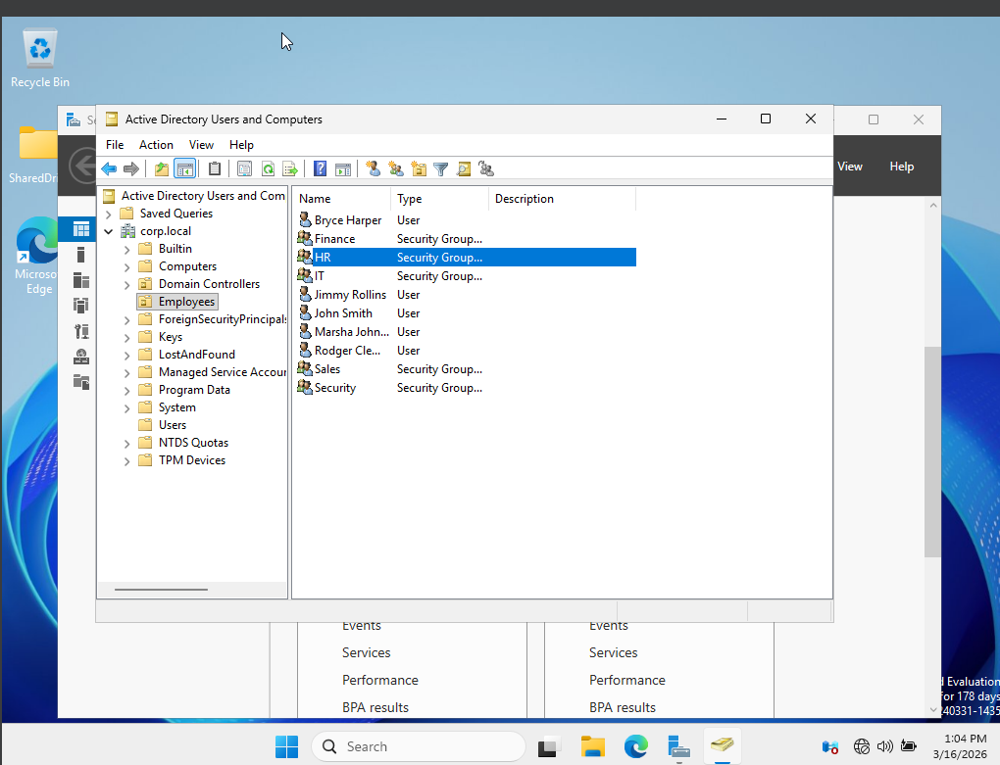

## Step 5: Created a Shared Network Drive

Created a network drive that is shared between all users within group policy management 

### Shared Drive
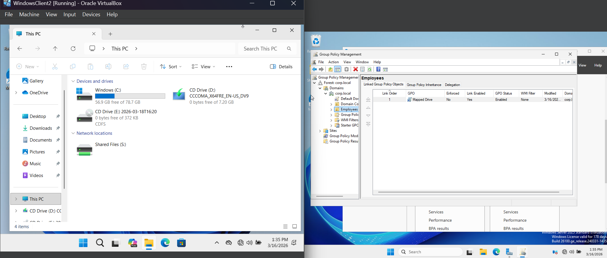

## Step 6: Installed DHCP

Installed DHCP so I can add client machines that will have automatic IPs within scope of 192.168.1.50 - 192.168.1.100

### DHCP with Two Clients
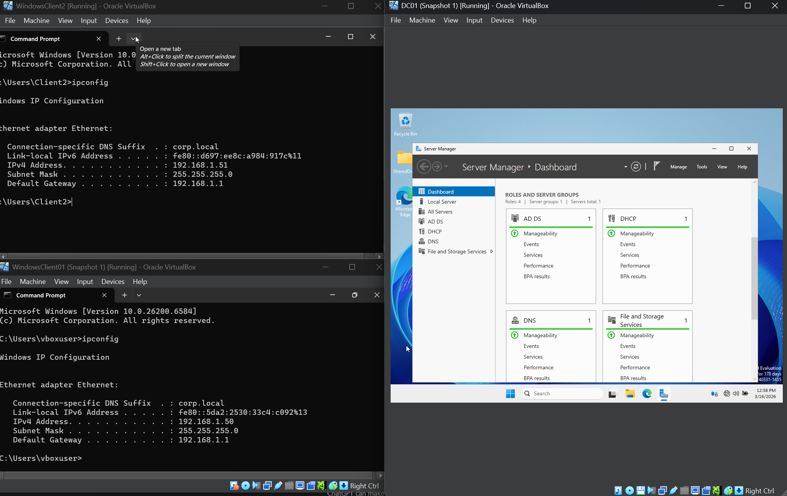

## Step 7: Joined Client Machines to the Domain

I created two clients using Windows 11 Pro and joined them both to the domain using DHCP 

### Domain Join in System Properties
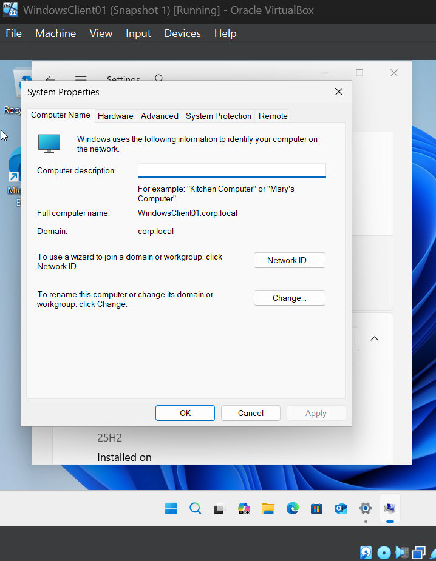

## Step 8: Added Group Policy Disabling Control Panel and Account Lockouts after Failed Logins 

I added a simple group policy that would disable the control panel for one user and another that would lock account after 5 failed logins

### Disabled Control Panel Policy 
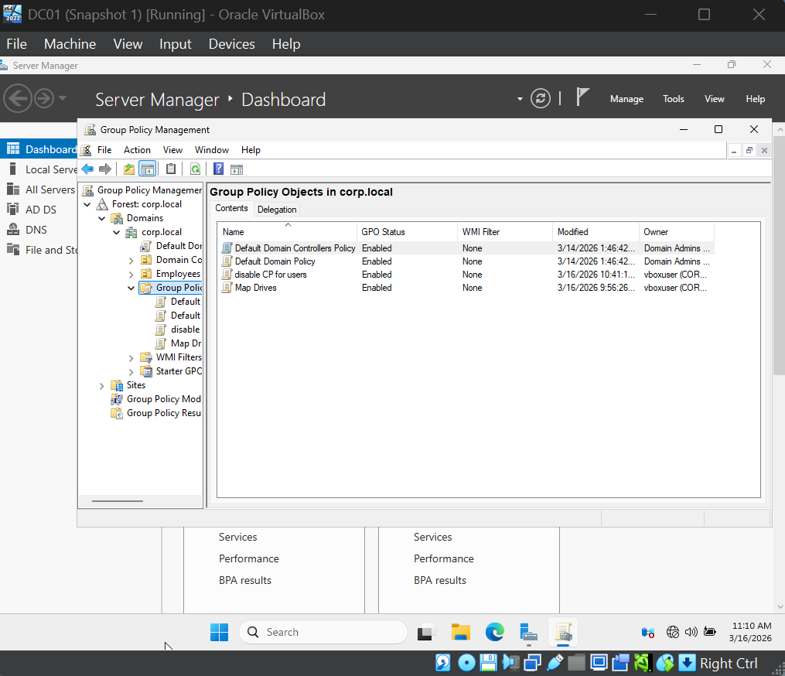
### Disabled Control Panel in Effect
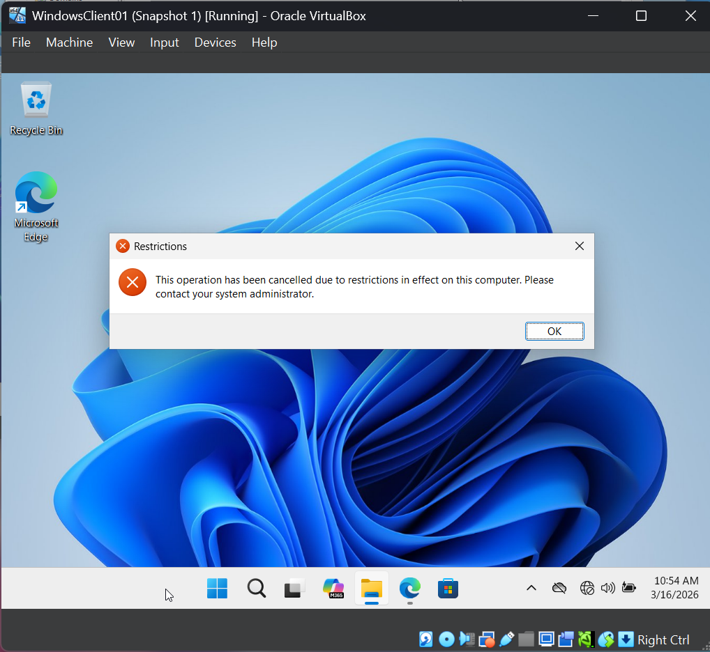
### Account Lockout from Failed Logins
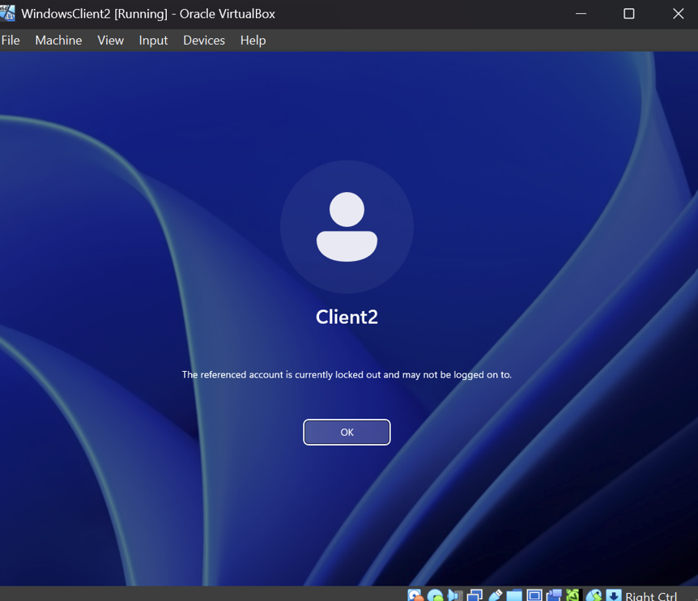

## Step 9: Installed Splunk SIEM 

Installed the Splunk SIEM tool on the domain controller VM to monitor logs from the DC and client machines such as account lockouts, new users created, and login attempts 

### Searching Failed Logins with Event Code 4625
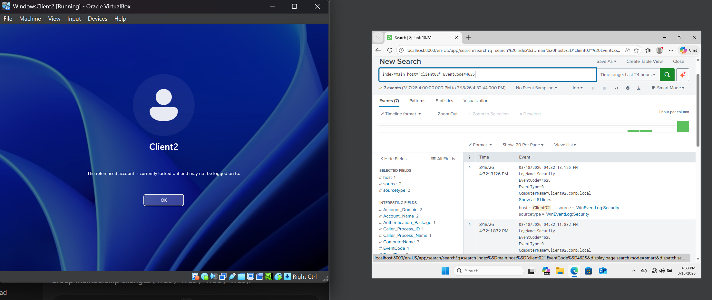
### Searching Locked User Accounts with Event Code 4740
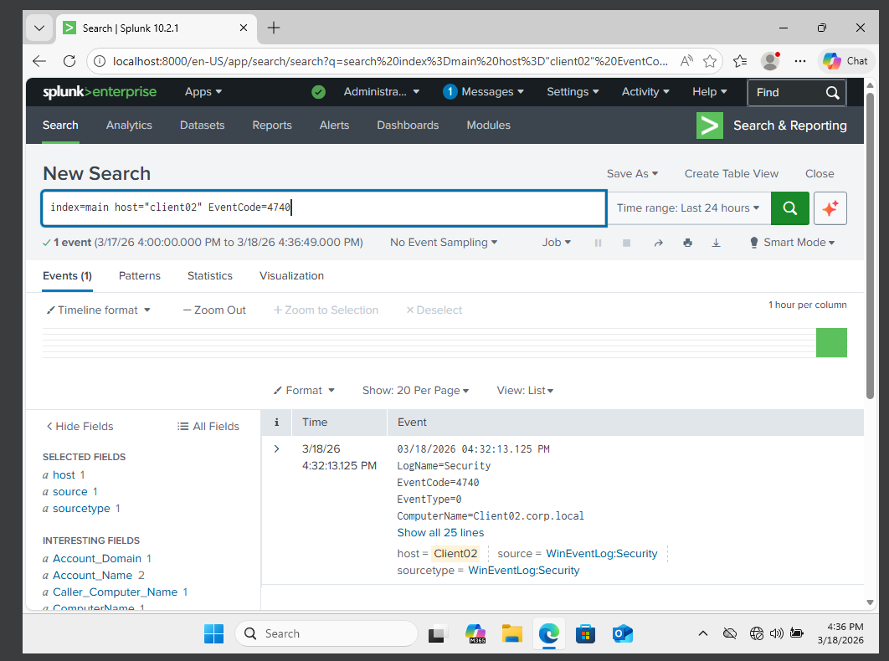
### Searching Newly Created Users with Event Code 4720
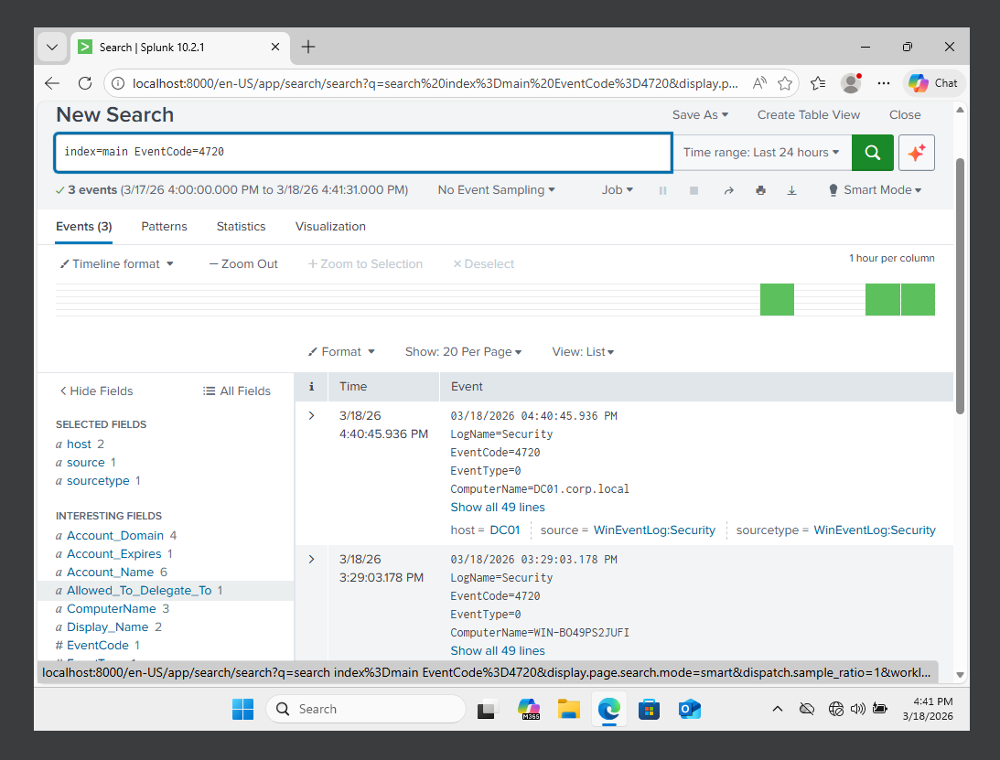

